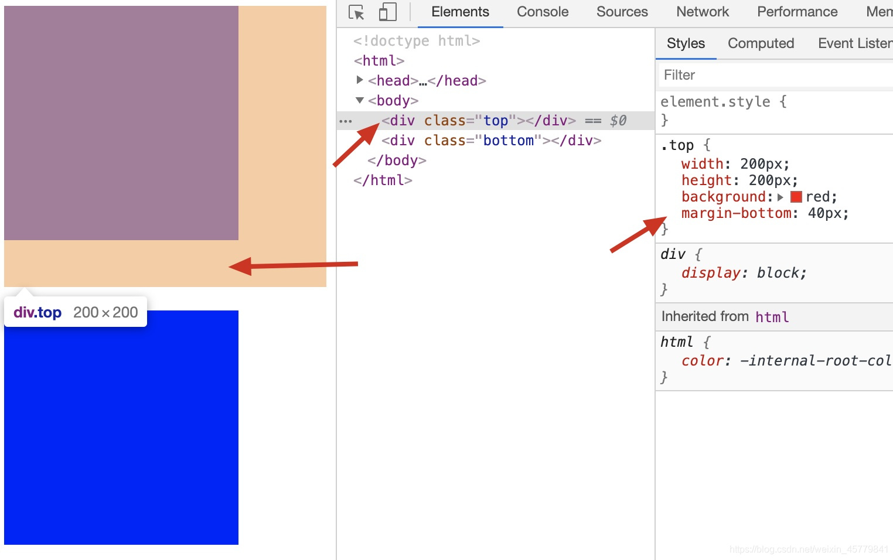
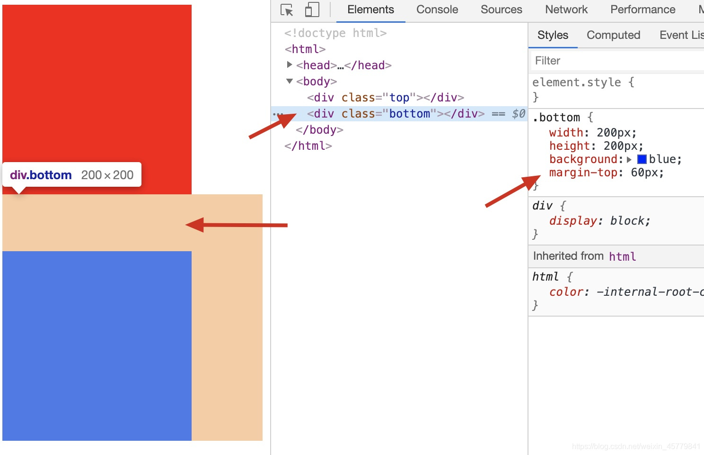
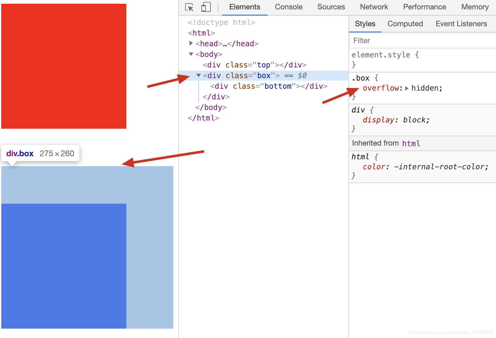
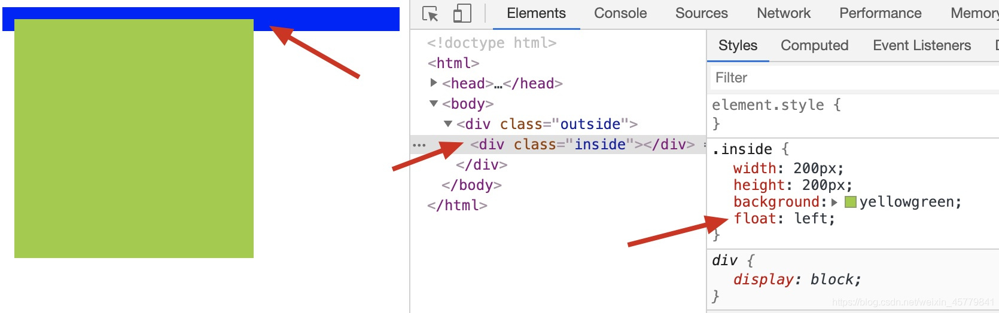
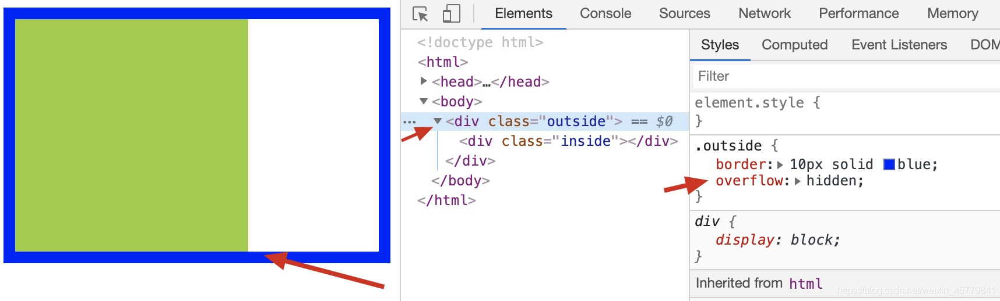
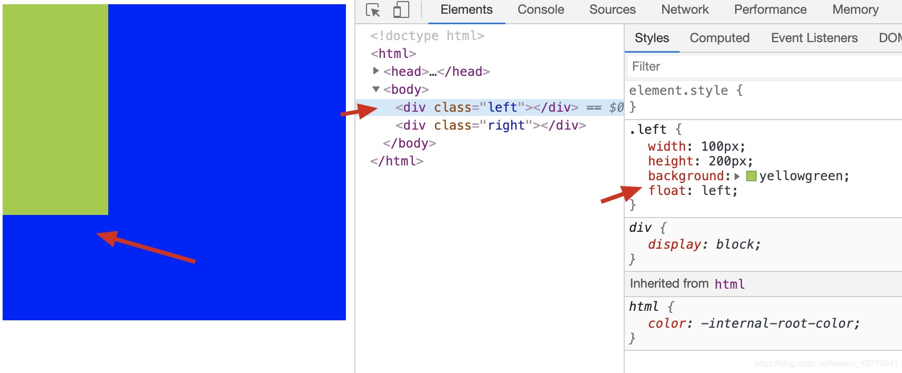
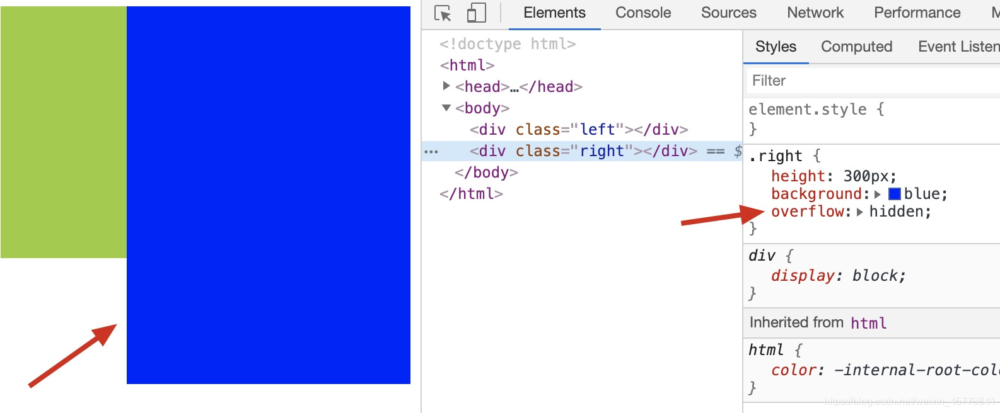
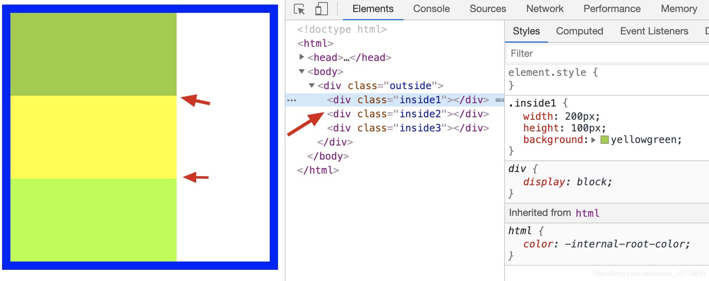
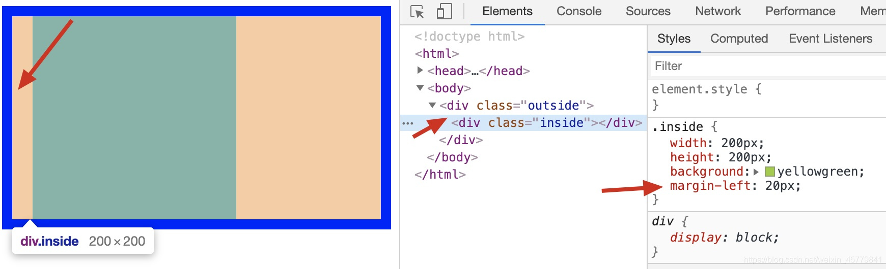

### 一、BFC是什么？
官方定义，BFC（Block Formatting Context，块格式化上下文） 是Web页面的可视化CSS渲染的一部分，是块盒子的布局过程发生的区域，也是浮动元素与其他元素交互的区域。

看不明白？那就对了！
官方解释若不搞得抽象难懂些，怎能显出高大上？！（手动滑稽）
还是让逆战在新冠疫情期的我来给你解答吧！

#### 个人理解
1. BFC是一个独立的布局环境，BFC内部的元素布局与外部互不影响；
2. 可以通过一些条件触发BFC，从而实现布局上的需求或解决一些问题；
3. 可以将BFC想象成一个工具，无需探究其定义，只要着重理解其功能（特性）即可。

### 二、BFC有什么用？
##### BFC的触发条件
1. 根元素（`<html>`）
2. float值非none
3. overflow值非visible
4. display值为inline-block、table-cell、table-caption、flex、inline-flex
5. position值为absolute、fixed

##### BFC的特性
1. 属于同一个BFC的两个相邻容器的上下margin会重叠（重点）
2. 计算BFC高度时浮动元素也参于计算（重点）
3. BFC的区域不会与浮动容器发生重叠（重点）
4. BFC内的容器在垂直方向依次排列
5. 元素的margin-left与其包含块的border-left相接触
6. BFC是独立容器，容器内部元素不会影响容器外部元素

【注：其中1、2、3需重点理解，其特性和功能下面将用代码逐个演示；
4、5、6为基本现象，按字面意思理解即可，不做重点说明。】

##### 特性1：属于同一个BFC的两个相邻容器的上下margin会重叠
功能：可解释为何相邻两容器上下外边距会发生重叠
```HTML
<!DOCTYPE html>
<html>
	<head>
		<meta charset="utf-8">
		<title></title>
        <style type="text/css">
            .top{
                width: 200px;
                height: 200px;
                background: red;
                margin-bottom: 40px;
            }
            .bottom{
                width: 200px;
                height: 200px;
                background: blue;
                margin-top: 60px;
            }
        </style>
	</head>
	<body>
        <div class="top"></div>
        <div class="bottom"></div>
	</body>
</html>
```
代码渲染效果如下：
图1：红色块下外边距上面色块给下外边距40px

图2：蓝色块上外边距
下面色块给上外边距60px



现象：
当给红色块下外边距margin-bottom，给蓝色块上外边距margin-top时，上下外边距会发生重叠，两个色块的间距解析为两者中的较大值（60px）。

原因：
此时红色块和蓝色块属于同一个BFC，即根元素（<html>）。BFC的特性1规定 “属于同一个BFC的两个相邻容器的上下margin会重叠”，故两者上下边距发生重叠。

##### 通过BFC特性解决上下margin的重叠问题：
```HTML
<!DOCTYPE html>
<html>
	<head>
		<meta charset="utf-8">
		<title></title>
        <style type="text/css">
            .top{
                width: 200px;
                height: 200px;
                background: red;
                margin-bottom: 60px;
            }
            .bottom{
                width: 200px;
                height: 200px;
                background: blue;
                margin-top: 60px;
            }
            .box{
                overflow: hidden;
            }
        </style>
	</head>
	<body>
        <div class="top"></div>
        <div class="box">
            <div class="bottom"></div>
        </div>
	</body>
</html>
```
代码渲染效果如下：


现象：
给蓝色块添加父元素.box并添加声明overflow: hidden;可以解决红色块和蓝色块的上下margin重叠问题。

原因：
通过给蓝色块添加父元素.box并添加声明overflow: hidden;，使得父元素.box触发了BFC（见BFC触发条件3），此时红色块和蓝色块属于不同的BFC，红色块的BFC仍然是根元素（<html>），蓝色块的BFC是父元素.box。即不满足BFC特性1中的规定“属于同一个BFC······”，从而解决了两者的上下margin重叠问题。

注：overflow: hidden;只是触发BFC众多条件中的一个，使用其他条件也能解决此问题，注意触发条件可能造成的其他影响即可，如浮动会造成的脱离文档流等。

##### 特性2：计算BFC高度时浮动元素也参于计算
功能：可解释为何overflow: hidden;能解决父元素高度塌陷
```HTML
<!DOCTYPE html>
<html>
	<head>
		<meta charset="utf-8">
		<title></title>
        <style type="text/css">
            .outside{
                border: 10px solid blue;
            }
            .inside{
                width: 200px;
                height: 200px;
                background: yellowgreen;
                float: left;
            }
        </style>
	</head>
	<body>
        <div class="outside">
            <div class="inside"></div>
        </div>
	</body>
</html>
```
代码渲染效果如下：

现象：
当父元素.outside没有设置高度且子元素.inside都浮动时，父元素.outside会出现高度塌陷。

原因：
子元素.inside设置浮动后脱离文档流，而父元素.outside又没有设置高度，故父元素.outside会出现高度塌陷。

##### 通过BFC特性解决高度塌陷问题：
```HTML
<!DOCTYPE html>
<html>
	<head>
		<meta charset="utf-8">
		<title></title>
        <style type="text/css">
            .outside{
                border: 10px solid blue;
                overflow: hidden;
            }
            .inside{
                width: 200px;
                height: 200px;
                background: yellowgreen;
                float: left;
            }
        </style>
	</head>
	<body>
        <div class="outside">
            <div class="inside"></div>
        </div>
	</body>
</html>
```
代码渲染效果如下：

现象：
给父元素.outside添加声明overflow: hidden;，父元素高度塌陷消失。

原因：
给父元素.outside添加声明overflow: hidden;，使得父元素.outside触发了BFC（见BFC触发条件3），而BFC特性规定“计算BFC高度时浮动元素也参于计算”，此时子元素.inside虽然设置了浮动，但其高度仍计算至父元素内，从而解决了高度塌陷问题。

##### 特性3：BFC的区域不会与浮动容器发生重叠
功能：在布局上实现自适应两栏（三栏）
```HTML
<!DOCTYPE html>
<html>
	<head>
		<meta charset="utf-8">
		<title></title>
        <style type="text/css">
            .left{
                width: 100px;
                height: 200px;
                background: yellowgreen;
                float: left;
            }
            .right{
                height: 300px;
                background: blue;
            }
        </style>
	</head>
	<body>
        <div class="left"></div>
        <div class="right"></div>
</html>
```

代码渲染效果如下：

##### 现象：
正常情况下，左侧元素.left浮动时，会与右侧元素.right发生重叠，不能实现自适应两栏效果。

##### 原因：
左侧元素浮动，脱离文档流。

##### 通过BFC特性解决重叠问题：
```HTML
<!DOCTYPE html>
<html>
	<head>
		<meta charset="utf-8">
		<title></title>
        <style type="text/css">
            .left{
                width: 100px;
                height: 200px;
                background: yellowgreen;
                float: left;
            }
            .right{
                height: 300px;
                background: blue;
                overflow: hidden;
            }
        </style>
	</head>
	<body>
        <div class="left"></div>
        <div class="right"></div>
    </body>
</html>
```
代码渲染效果如下：

现象：
给右侧元素.right添加声明overflow: hidden;，左右侧元素重叠消失，实现自适应两栏效果。

##### 原因：
给右侧元素.right添加声明overflow: hidden;，使得右侧元素触发了BFC（见BFC触发条件3），而BFC特性规定“BFC的区域不会与浮动容器发生重叠”，从而解决了重叠问题，实现自适应两栏效果。

##### 特性4：BFC内的容器在垂直方向依次排列
类似正常情况下块元素在垂直方向上依次排列，较易理解。


##### 特性5：元素的margin-left与其包含块的border-left相接触
基本现象，较易理解。


##### 特性6：BFC是独立容器，容器内部元素不会影响容器外部元素
较易理解。

### BFC功能总结
1. 可以利用BFC解决两个相邻元素的上下margin重叠问题；
2. 可以利用BFC解决高度塌陷问题；
3. 可以利用BFC实现多栏布局（两栏、三栏、圣杯、双飞翼等）。