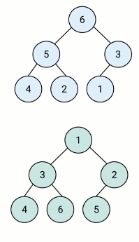
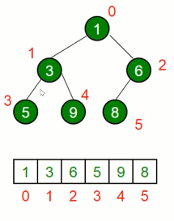

### 堆是什么？
* 堆是一种特殊的完全二叉树
* 所有的节点都大于等于(最大堆)或小于等于（最小堆）它的子节点
  
  

### JS中的堆
* JS中通常用数组表示堆
* 左侧子节点的位置是 2 * index + 1
* 右侧子节点的位置是 2 * index + 2
* 父节点位置是（index - 1）/ 2
  
  

### 堆的应用
* 堆能高效。快速地找出最大值和最小值，时间复杂度：O（1）
* 找出第k个最大（小）元素

#### 第k个最大（最小）元素
* 构建一个最小（最大）堆，并将元素依次插入堆中
* 当堆的容量超过k，就删除堆顶
* 插入结束后，堆顶就是第k个最大元素