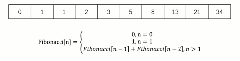

### 动态规划是什么？
* 动态规划是算法设计中的一种方法
* 它将一个问题分解为互相重叠的子问题，通过反复求解子问题，来解决原来的问题

#### 斐波那契额数列


* 定义子问题：`F（n） = F（n-1）+ F（n-2）`
* 反复执行：从2循环到n，执行上述公式

### 动态规划 VS 分而治之
* 子问题是否独立

### LeetCode #70 爬楼梯
假设你正在爬楼梯。需要 n 阶你才能到达楼顶。

每次你可以爬 1 或 2 个台阶。你有多少种不同的方法可以爬到楼顶呢？

注意：给定 n 是一个正整数。

示例 1：

* 输入： 2
* 输出： 2
* 解释： 有两种方法可以爬到楼顶。
  1.  1 阶 + 1 阶
  2.  2 阶

示例 2：

* 输入： 3
* 输出： 3
* 解释： 有三种方法可以爬到楼顶。
  1.  1 阶 + 1 阶 + 1 阶
  2.  1 阶 + 2 阶
  3.  2 阶 + 1 阶

解题思路：
1. 爬到第n阶可以在第n-1阶爬1个台阶，或者在第n-2阶爬2个台阶
2. `F（n）= F（n - 1）+ F（n - 2）`
3. 使用动态规划

解题步骤：
1. 定义子问题：`F（n）= F（n - 1）+ F（n - 2）`
2. 反复执行：从2循环到n，执行上述公式

复杂度：
1. 时间复杂度：O（n）
3. 空间复杂度：O（n）
```JavaScript
/**
 * @param {number} n
 * @return {number}
 */
var climbStairs = function(n) {
    if(n < 2){
        return 1
    };
    const dp = [1, 1]; // 记录第n阶需要多少种方法
    for(let i = 2; i <= n; i += 1){
        dp[i] = dp[i - 1] + dp[i - 2];
    }
    // console.log(dp);
    return dp[n];
};
```

```JavaScript
/**
 * @param {number} n
 * @return {number}
 */
var climbStairs = function(n) {
    if(n < 2){
        return 1
    };
    // const dp = [1, 1]; // 记录第n阶需要多少种方法
    // 优化空间复杂度，不用数组记录
    let dp0 = 1;
    let dp1 = 1;
    for(let i = 2; i <= n; i += 1){
        // dp[i] = dp[i - 1] + dp[i - 2];
        // 优化：不断的用dp0和dp1来表示数组的倒数两个数字
        const temp = dp0;
        dp0 = dp1;
        dp1 = dp1 + temp;
    }
    // console.log(dp);
    // return dp[n];
    return dp1;
};
```
### LeetCode #198 打家劫舍
你是一个专业的小偷，计划偷窃沿街的房屋。每间房内都藏有一定的现金，影响你偷窃的唯一制约因素就是相邻的房屋装有相互连通的防盗系统，如果两间相邻的房屋在同一晚上被小偷闯入，系统会自动报警。

给定一个代表每个房屋存放金额的非负整数数组，计算你 不触动警报装置的情况下 ，一夜之内能够偷窃到的最高金额。

示例 1：

* 输入：[1,2,3,1]
* 输出：4
* 解释：偷窃 1 号房屋 (金额 = 1) ，然后偷窃 3 号房屋 (金额 = 3)。
     偷窃到的最高金额 = 1 + 3 = 4 。

示例 2：
* 输入：[2,7,9,3,1]
* 输出：12
* 解释：偷窃 1 号房屋 (金额 = 2), 偷窃 3 号房屋 (金额 = 9)，接着偷窃 5 号房屋 (金额 = 1)。
     偷窃到的最高金额 = 2 + 9 + 1 = 12 。


提示：
* 0 <= nums.length <= 100
* 0 <= nums[i] <= 400

解题思路：
1. f（k） = 从前k个房屋中能偷窃到的最大数额
2. Ak = 第k个房屋的钱数
3. f（k）= max（f（k - 2）+ Ak，f（k - 1））
4. 考虑动态规划

解题步骤：
1. 定义子问题：f（k）= max（f（k - 2）+Ak，f（k-1））
2. 反复执行：从2 循环到n，执行上述公式

复杂度：
1. 时间复杂度：O（n）
3. 空间复杂度：O（n）

```JavaScript
/**
 * @param {number[]} nums
 * @return {number}
 */
var rob = function(nums) {
    if(nums.length === 0){
        return 0;
    }
    const dp = [0, nums[0]]; // 房屋，房屋能得到的钱
    for(let i = 2; i <= nums.length; i += 1){
        // console.log(i)
        // console.log(dp);
        dp[i] = Math.max(dp[i - 2] + nums[i - 1], dp[i-1]);// 房间数从0开始
    }
    console.log(dp);
    return dp[nums.length];
};
```
优化空间复杂度：O（1）使用两个变量记录，代替数组做记录
```JavaScript
/**
 * @param {number[]} nums
 * @return {number}
 */
var rob = function(nums) {
    if(nums.length === 0){
        return 0;
    }
    // const dp = [0, nums[0]]; // 房屋，房屋能得到的钱
    // 优化空间复杂度：不用数组记录，用变量
    let dp0 = 0, dp1 = nums[0];
    for(let i = 2; i <= nums.length; i += 1){
        // dp[i] = Math.max(dp[i - 2] + nums[i - 1], dp[i-1]);// 房间数从0开始
        // 优化
        const dp2 = Math.max(dp0 + nums[i - 1], dp1);
        dp0 = dp1;
        dp1 = dp2;
    }
    // console.log(dp);
    // return dp[nums.length];
    return dp1;
};
```

### 动态规划章节总结
### 动态规划是什么？
* 动态规划是算法设计中的一种方法
* 它将一个问题分解为相互重叠的子问题，通过反复求解子问题，来解决原来的问题

### 动态规划的步骤
* 定义子问题
* 反复执行
### 阶段性思考
* 说出动态规划算法的套路步骤
* 完成打家劫舍2  #213 https://leetcode-cn.com/problems/house-robber-ii/